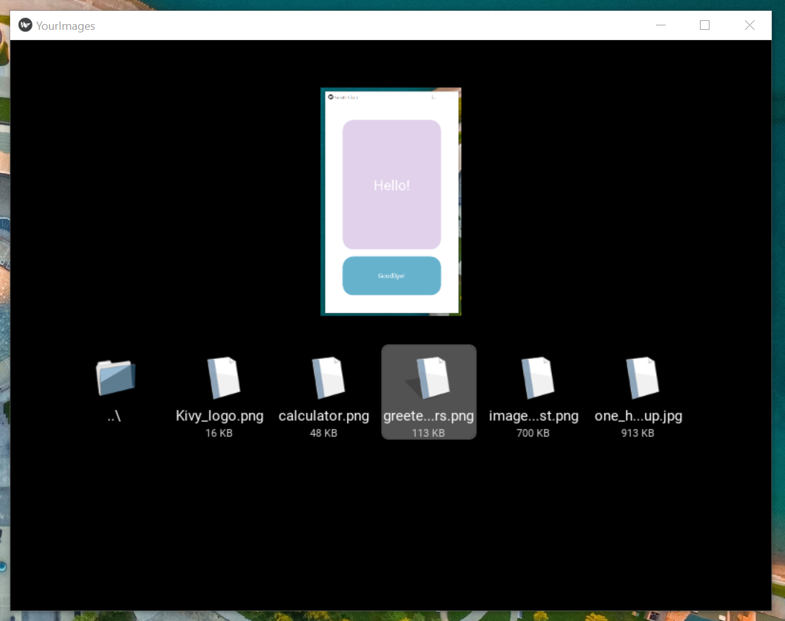
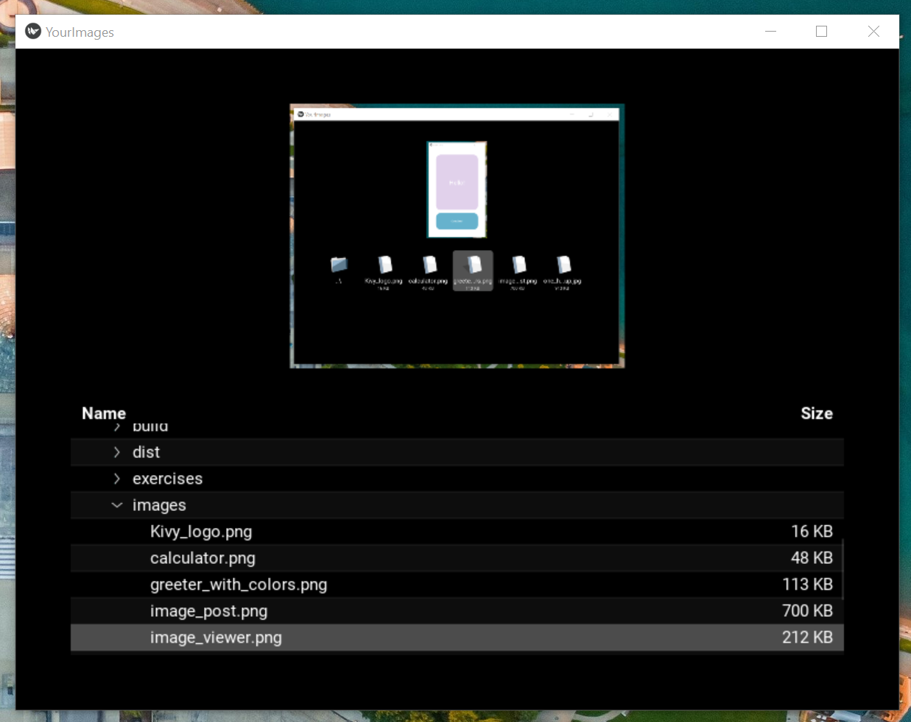

## Fourth Achievement
Allowing users to view a gallery of their photos is a common feature among apps. The goal here was to allow users to view their photos from within the app. This feature can extend to users posting their own photos onto the app. (The first snapshot uses Icon View, and the second uses List View.)
 
 

