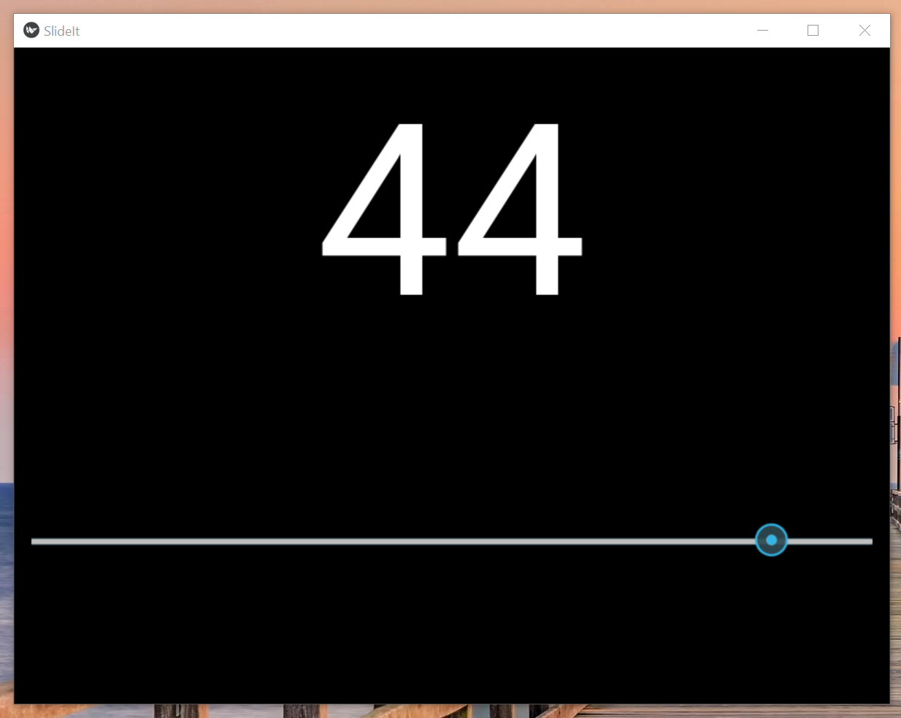
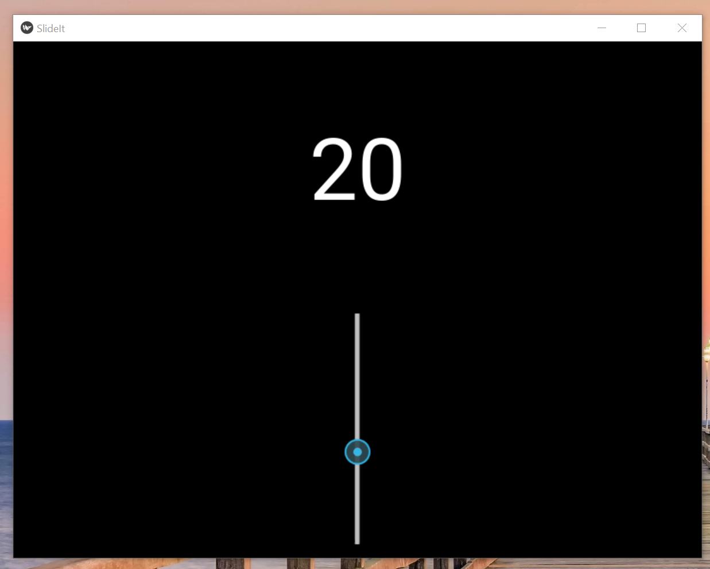

## Sixth Achievement
One purpose of a slider is to scale an amount or object. Users can customize the size and number attribute of an item using a slider. The goal here was to allow a customization feature for the user. (The first two snapshots are of horizontal sliders. As the slider moves to the right, the object size increases, in this case the object is a number representing the position the slider from range 0 to 50. The third snapshot is of a vertical slider serving the same purpose.)
 
 

