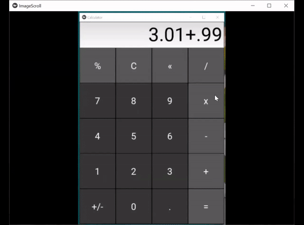

## Eighth Achievement
The carousel scrolling feature allows users to scroll through content smoothly. The direction of the scroll at the starting point can be right, left, top, or bottom. The goal here was to incorporate ease to browsing of content. (The example below is set to a direction of 'bottom'.)
 
 

<!--  -->
