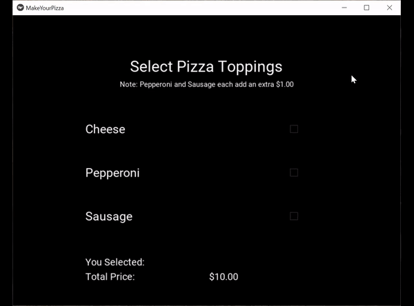

## Ninth Achievement
Checkboxes help to automate user requests and is a common tool used in many apps and websites providing a range of services and/or products. The goal here was to allow the user to easily customize a service and/or product. (The example below shows how a user can customize pizza toppings by checking the corresponding checkbox.)
 
 
