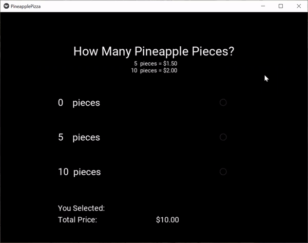

## Tenth Achievement
In some cases, radio buttons are more appropriate than checkboxes. Radio buttons allows the user to select only one option. The goal here was to give a different way for the user to customize a service and/or product.
 
 
