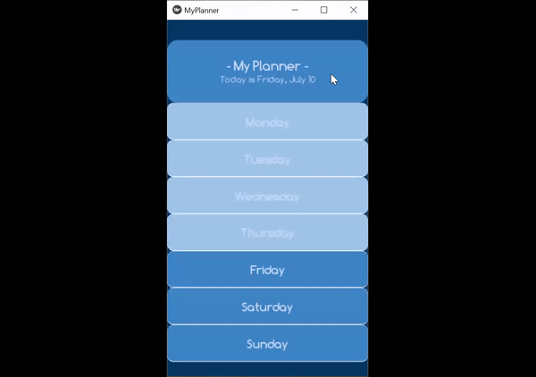

## Eleventh Achievement
Popup windows sometimes may be more favorable over clicking to the next page. Popup windows containing service components can help shorten the time the user spends to customize the settings of a service. The goal here was to decrease the number of steps a user needs to use a service.
 
 
