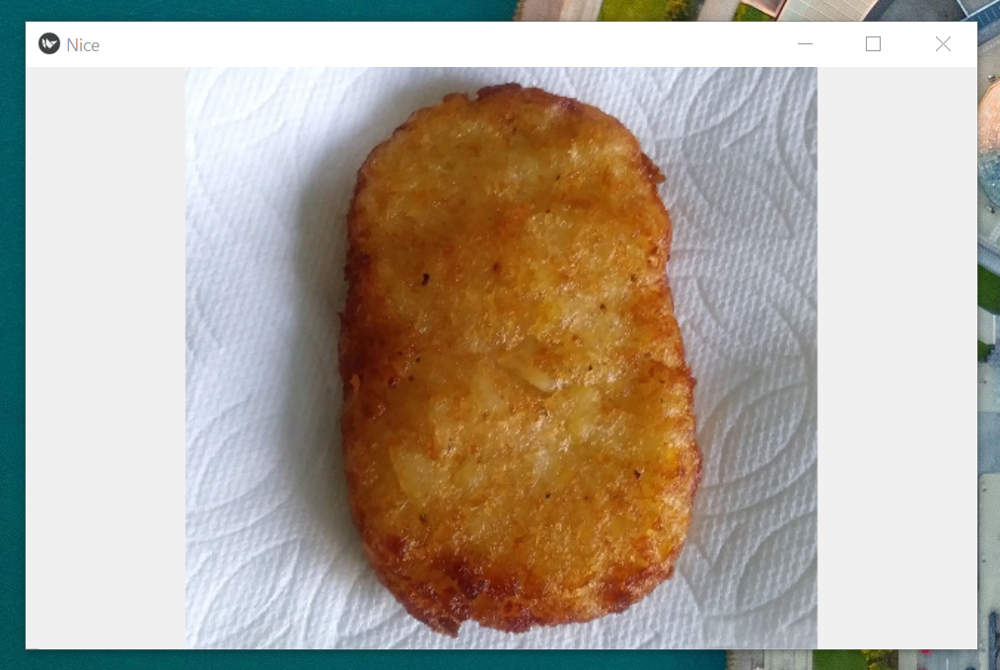

## Third Achievement
The aspect of posting images whether by the app creator/maintainer and by users enhance the user experience with its aesthethics. The goal here was to post an image onto an app. (This is an image of a homemade hashbrown that I airfried. I had enough ingredients to make two and this is the more aesthetically pleasing one.)
 
 

